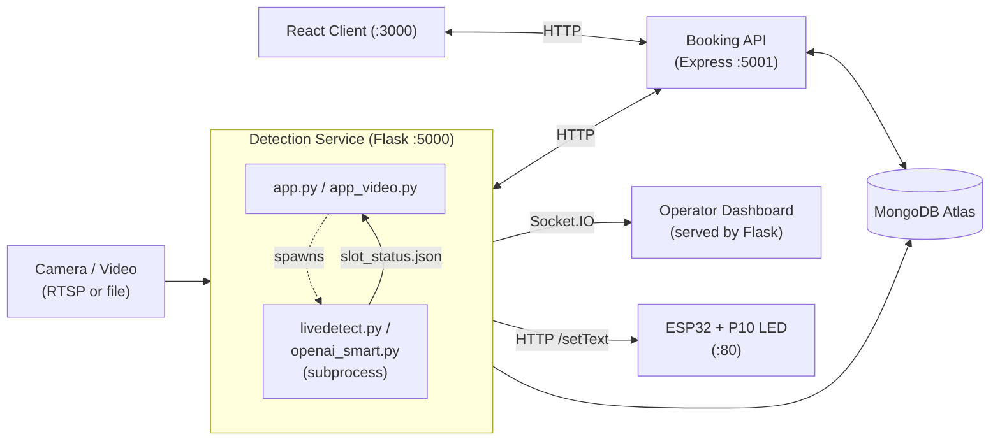
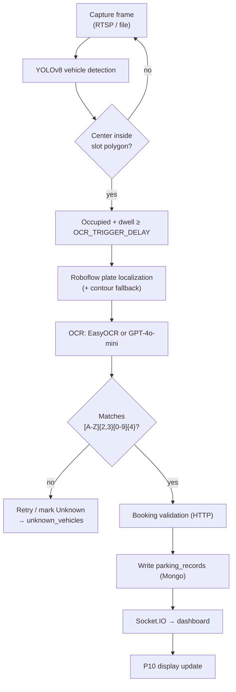

# ANPR AI Parking System — Architecture

This document describes the architecture of the **ANPR AI Parking System**: an
Automatic Number Plate Recognition (ANPR) parking platform that combines
real-time computer-vision vehicle detection, a customer-facing booking service,
a live operator dashboard, and a physical P10 LED display driven by an ESP32.

> All credentials and endpoints are supplied through environment variables. This
> document references only environment variable **names** — never their values.

---

## 1. Component Overview

The system is composed of five cooperating components.

| Component | Technology | Port | Responsibility |
|-----------|------------|------|----------------|
| **Detection service** | Python, Flask + Flask-SocketIO (threading async mode) | `5000` | Runs YOLOv8 vehicle detection, plate localization, OCR, persists records, serves the operator dashboard, and pushes live updates over Socket.IO. |
| **Booking API** | Node.js, Express | `5001` | Customer/admin auth, bookings, Stripe payments, slot-status lookups, and parking-integration endpoints consumed by the detection service. |
| **React client** | React (web) | `3000` | Customer/admin web UI for registration, booking, and payment. Allowed as a CORS origin by the booking API. |
| **ESP32 + P10 LED display** | ESP32 firmware (`arduino/p10_code.ino`), DMD32 + I2S audio | HTTP `80` | Shows slot status / plate / booking messages and sounds an audio alert for unauthorized vehicles. |
| **MongoDB Atlas** | MongoDB | — | Two logical databases: detection collections (`parking_system` DB) and the booking Mongoose models. |

The detection service and the booking API each have their own MongoDB connection
(`MONGO_URI` for detection, `MONGODB_URI` for the booking server) and their own
data model; they integrate over HTTP rather than sharing a database.

---

## 2. Detection Pipeline (Step by Step)

The detection service has two entry points that share nearly identical logic:

- **`app.py`** — production/live mode (default video source resolved from a
  `config` module; supports RTSP URLs and local files).
- **`app_video.py`** — local video-file mode (default source resolved from
  `config_video`), used for testing against recorded footage.

Both expose the same REST + Socket.IO surface and both **delegate the heavy
detection work to a child process** (see Section 3). The pipeline below
describes the end-to-end flow.

1. **Frame capture.** The detection script opens the configured source with
   OpenCV (`cv2.VideoCapture`). `app.py` (and `openai_smart.py`'s `main()`)
   branch on whether the source starts with `rtsp://`: RTSP streams use
   `initialize_rtsp_stream()` with `CAP_PROP_BUFFERSIZE=1`, buffer flushing
   (`get_latest_frame()`), health monitoring, and automatic reconnection;
   local files (used by `app_video.py` and the `livedetect.py` path) loop the
   video, resetting to frame 0 at end-of-stream. Each frame is resized to
   `1020x500`.

2. **YOLOv8 vehicle detection inside parking slots.** A local
   `YOLO('yolov8n.pt')` model runs per frame. Detections whose class is in
   `VEHICLE_CLASSES` (`car`, `truck`, `bus`, `motorcycle`) are kept. Each
   parking slot is a polygon defined in `PARKING_SLOTS` (two slots, `'1'` and
   `'2'`). A vehicle is assigned to a slot when its bounding-box center passes
   `cv2.pointPolygonTest` for that slot's polygon. Vehicle type is refined with
   a second YOLO pass on the cropped box (`detect_vehicle_type`).

3. **OCR trigger timing & plate localization.** After a vehicle has occupied a
   slot for `OCR_TRIGGER_DELAY` seconds, OCR is triggered (with retries every
   `OCR_RETRY_INTERVAL` up to `MAX_OCR_ATTEMPTS`). The relevant image half
   (left half for slot `1`, right half for slot `2`) is sent to **Roboflow**
   (`InferenceHTTPClient`, model `license-plate-recognition-rxg4e/11`,
   `api_key` from `ROBOFLOW_API_KEY`). The highest-confidence prediction above
   `PLATE_CONFIDENCE_THRESHOLD` (0.4) is cropped with padding. If Roboflow
   returns nothing, a contour-based fallback (`enhanced_fallback_plate_detection`)
   attempts to locate a plate.

4. **OCR via EasyOCR or OpenAI GPT-4o-mini.** Two interchangeable engines:
   - **EasyOCR** (`livedetect.py`): multiple preprocessing methods (CLAHE,
     bilateral filter, adaptive/Otsu thresholding, morphology) feed
     `reader.readtext`. `extract_plate_text_from_ocr_results` reconstructs the
     plate from single/combined detections, stripping Sri Lankan provincial
     codes.
   - **OpenAI** (`openai_smart.py`): each preprocessed image is base64-encoded
     and POSTed to `https://api.openai.com/v1/chat/completions` with model
     `gpt-4o-mini` (`OPENAI_API_KEY`). A prompt instructs the model to ignore
     provincial codes and return a `2-3 letters + 4 digits` plate or
     `UNREADABLE`. OpenAI calls are serialized via an OCR lock/queue
     (`OCR_MIN_INTERVAL`) to avoid concurrent-request conflicts.

5. **Confidence gating / validation.** Plates are validated against the Sri
   Lankan format `^[A-Z]{2,3}[0-9]{4}$` (`validate_license_plate` /
   `has_valid_license_plate`). EasyOCR additionally filters detections by a
   minimum confidence (`MIN_CONFIDENCE`, 0.3). After `MAX_OCR_ATTEMPTS`
   failures the slot is marked `Unknown <n>` and the crop is saved under
   `error_vehicles/`.

6. **Booking validation.** When a valid plate is found and booking integration
   is enabled, `booking_integration.validate_vehicle_arrival(slot_id, plate)`
   compares the detected plate against the slot's expected plate (from the
   booking API or the mock). OCR failures (`UNKNOWN*` / `UNREADABLE`) skip
   validation. A mismatch on a booked slot is logged as unauthorized and can
   trigger the ESP32 audio alert.

7. **MongoDB record.** `save_parking_record` inserts a document into
   `parking_records` (entry time in Asia/Colombo timezone, vehicle type,
   base64 image, OCR method, and `booking_info`). It skips creation if an open
   record (no `exit_time`) already exists for the slot. Failed-OCR vehicles are
   written to `unknown_vehicles`. On exit, `update_parking_record` sets
   `exit_time` and `duration` and notifies the booking API of departure.

8. **Socket.IO push to dashboard.** The Flask app maintains an in-memory
   `slot_status` and emits events to connected dashboard clients:
   `parking_status_update`, `new_parking_record`, `parking_record_updated`,
   and (in `app_video.py`) `license_plate_detected` / `refresh_records`.

9. **P10 display update.** Every status change calls `update_p10_display()` /
   `display_vehicle_event()`, which drive the `P10DisplayManager` to push the
   appropriate message to the ESP32 (Section 5).

---

## 3. Subprocess Model

The Flask app (`app.py` / `app_video.py`) does **not** run the camera loop in
its own process. When `POST /api/start-detection` is called,
`process_vehicle_detection()` selects a child script based on the currently
selected OCR engine (`current_ocr_method`):

| OCR engine | `app.py` spawns | `app_video.py` spawns |
|------------|-----------------|-----------------------|
| `EasyOCR`  | `livedetect.py` | `livedetect_video.py` |
| `OpenAI`   | `openai_smart.py` | `openai_smart_video.py` |

The script is launched with `subprocess.Popen([sys.executable, script])`
(on Windows, in a new console via `CREATE_NEW_CONSOLE`). The two processes
communicate through the filesystem:

- The **child** runs the OpenCV/YOLO/OCR loop and writes the current slot state
  to **`slot_status.json`** (`save_slot_status_to_file`); cropped images are
  written under `debug_cars/`, `debug_plates/`, and `error_vehicles/`.
- The **parent** Flask app polls `slot_status.json` and the debug folders
  (`update_slot_status_from_debug_folders`), reconciles entries/exits (with a
  short-stay exit-confirmation guard in `app.py`), persists records to MongoDB,
  emits Socket.IO updates, and refreshes the P10 display.

This keeps the GUI/window and blocking inference loop isolated from the web
server's request handling and Socket.IO event loop.

---

## 4. Detection ↔ Booking Integration (HTTP)

`booking_integration.py` wraps all calls from the detection side to the booking
API. It is configured via `config_booking` (`BOOKING_MODE` ∈ {`mock`, `real`,
`auto`}, `BOOKING_API_URL`). A `MockBookingSystem` provides offline test data
and is also used as an automatic fallback when the booking API is unreachable
or times out. Key calls (base URL defaults to the booking server on port `5001`):

| Method (Python) | HTTP call | Purpose |
|-----------------|-----------|---------|
| `get_slot_status()` / `get_active_bookings()` | `GET /api/parking/slot-status` | Fetch active bookings; maps `Slot 1`/`Slot 2` → `1`/`2`. |
| `update_booking_arrival()` | `POST /api/parking/update-arrival` | Record actual arrival time. |
| `update_booking_departure()` | `POST /api/parking/update-departure` | Record actual departure time. |
| `send_unauthorized_vehicle_alert()` | `POST /api/parking/unauthorized-vehicle` | Report a plate that does not match the slot's booking. |
| `send_slot_conflict_alert()` | `POST /api/parking/slot-conflict` | Report multiple plates in one slot. |
| `send_booking_reminder()` | `POST /api/parking/send-reminder` | Trigger a reminder SMS for a booking. |
| `check_booking_system_health()` | `GET /api/health` | Liveness probe. |

The booking server's `routes/parking-integration.js` implements
`/unauthorized-vehicle`, `/slot-conflict`, `/slot-status`, `/send-reminder`,
and a `/realtime-status` endpoint that itself reverse-proxies the detection
service's `GET /api/parking-status` (probing `:5000`/`:5001` on
localhost). Unauthorized/conflict handlers look up the matching `Booking` for
the current date/time window and dispatch SMS via `utils/smsService`.

> Note: the detection side uses `update-arrival` / `update-departure` paths;
> the reviewed booking routes implement the alert, slot-status, and reminder
> endpoints. The arrival/departure handlers are not present in
> `routes/parking-integration.js` as reviewed.

---

## 5. P10 HTTP Protocol (ESP32 `setText`)

`p10_display_manager.py` talks to the ESP32 over plain HTTP GET requests to
`http://<ESP32_IP>/setText` (`ESP32_IP`, `ESP32_KEY` from `config_p10`, with
defaults in code). Every request carries a `Settings` query parameter whose
value is a comma-separated string **prefixed with the shared key** — this key
acts as the authentication token. The ESP32 (`p10_code.ino`,
`#define key_Txt`) rejects any request whose first field does not match its
configured key, replying `+ERR`; valid requests reply `+OK`.

Message grammar (`Settings=<key>,<MODE>,...`):

| Mode | Format | Behavior on ESP32 |
|------|--------|-------------------|
| `SR`  | `<key>,SR,<text>` | Single-row scrolling text. |
| `DBS` | `<key>,DBS,<row1>,<pos>,<row2>` | Double row, both static. |
| `DBM` | `<key>,DBM,<row1>,<pos>,<row2>` | Double row, row 1 static, row 2 animated. |
| `DBA` | `<key>,DBA,<row1>,<pos>,<row2>` | Double row, both animated. |
| `AUDIO_ALERT` | `<key>,AUDIO_ALERT,START\|STOP` | Start/stop the unauthorized-vehicle beep. |

The firmware persists the last text/mode to flash (`Preferences`) and renders
on a 2-wide P10 panel via DMD32, refreshed by a hardware-timer interrupt. The
audio alert is generated on an I2S DAC: a `1800 Hz` tone in a `0.5 s` beep /
`0.5 s` silence cycle, auto-stopping after `60 s` (`alertDuration`). The
manager de-duplicates identical consecutive messages and runs a background
display cycle (`start_display_cycle`) that rotates between slot status, plate
readouts, "vehicle entering/leaving" events, and unauthorized-vehicle warnings
(including "PLEASE REMOVE YOUR VEHICLE" and booking-conflict "ATTENTION"
messages).

---

## 6. Data Model

### 6.1 Detection collections (`parking_system` database, PyMongo)

- **`parking_records`** — one document per parked vehicle session:
  `slot_id`, `license_plate`, `vehicle_type`, `vehicle_image` (base64),
  `entry_time`, `exit_time`, `duration`, `ocr_method`, `created_at`,
  `updated_at`, and an embedded `booking_info`
  (`order_id`, `customer_name`, `is_pre_booked`, `booking_status`). Records are
  timestamped in the `Asia/Colombo` timezone.
- **`unknown_vehicles`** — vehicles whose plate could not be read:
  `slot_id`, `vehicle_image` (base64), `detection_time`, `ocr_method`,
  `created_at`.
- **`system_status`** — small key/value store; e.g. the active OCR method is
  upserted under `{ key: "ocr_method", value, updated_at }` by
  `POST /api/switch-ocr`.

### 6.2 Booking Mongoose models (booking server)

- **`User`** — `name`, `email` (unique, lowercased), `phone`, `password`
  (bcrypt-hashed in a `pre('save')` hook), `role` (`user` | `admin`),
  `isActive`, timestamps. Provides a `comparePassword()` method.
- **`Booking`** — `orderId` (auto-generated `ORD<YYMMDD><random>`), `user`
  (ref `User`), `slotNumber`, `date`, `startTime`, `endTime`, nested
  `vehicleDetails` (`make`, `model`, `color`, `licensePlate`),
  `customerDetails` (`name`, `phone`, `email`), nested `payment`
  (`amount`, `currency` default `LKR`, `status`, Stripe identifiers),
  `status` (`confirmed` | `cancelled` | `completed` | `no_show`),
  `isPreBooked`, `actualArrivalTime`, `actualDepartureTime`, plus indexes on
  slot/date/time, user, and order id.
- **`SlotStatus`** — time-series slot state: `slotNumber` (enum `1`/`2`),
  `status` (`free` | `busy` | `unknown`), `timestamp`, `updatedBy` (ref `User`,
  optional), `source` (`detection_system` | `manual` | `booking_system`), and a
  `metadata` mixed field. Static helpers expose latest status, history, and
  current status across slots.

---

## 7. Booking API Surface (Express)

Mounted in `index.js` (fails fast if `MONGODB_URI`, `JWT_SECRET`, or
`STRIPE_SECRET_KEY` are missing; CORS restricted to `ALLOWED_ORIGINS`,
default `http://localhost:3000`):

- `/api/auth` — `register`, `login`, `GET/PUT /profile` (JWT `protect`).
- `/api/bookings` — `available-slots`, create booking, `my-bookings`,
  `active`, get/cancel by id.
- `/api/payments` — Stripe checkout session, `webhook` (raw body), status and
  session verification.
- `/api/admin` — bookings, statistics, status updates, user management, and
  slot-conflict views.
- `/api/slots` — `GET/POST /status`, `GET /history/:slotNumber`.
- `/api/parking` — the integration endpoints described in Section 4.
- `/api/health` — server/Stripe/Mongo readiness.

---

## 8. Configuration & Secrets

No secrets are hard-coded. Components read configuration from environment
variables (loaded from local `.env` files) and small Python `config*` modules:

- **Detection:** `MONGO_URI`, `ROBOFLOW_API_KEY`, `OPENAI_API_KEY`,
  `FLASK_SECRET_KEY`, `RTSP_URL`; plus `config` (`PARKING_SLOTS`,
  `VIDEO_SOURCE`, OCR timing), `config_p10` (`ESP32_IP`, `ESP32_KEY`),
  `config_booking` (`BOOKING_MODE`, `BOOKING_API_URL`).
- **Booking server:** `MONGODB_URI`, `JWT_SECRET`, `STRIPE_SECRET_KEY`,
  `STRIPE_PUBLISH_KEY`, `PORT`, `NODE_ENV`, `ALLOWED_ORIGINS`.
- **ESP32:** WiFi SSID/password and the `key_Txt` shared key are set in the
  firmware before flashing.
